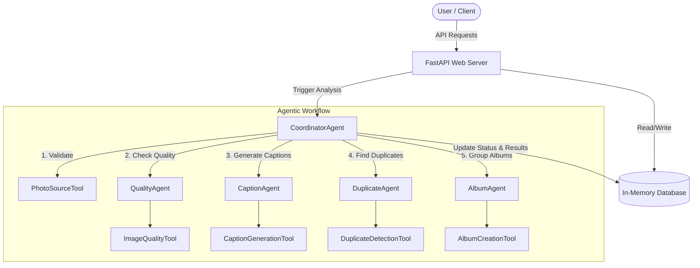

# PicsDrop AI - Architecture Documentation

This document explains the technical design, agent workflow, and API schemas for **PicsDrop AI**.

---

## 🏗️ System Overview

PicsDrop AI is an AI-driven image memory indexing system. It operates on **Collections** (events, albums, or batches of photos). The system extracts metadata, tags, quality scores, clusters visual duplicates, and organizes photos into themed albums.



---

## 🤖 Agentic Pipeline Details

### 1. CoordinatorAgent
The central coordinator that controls the execution of all other agents. 
- **Sequential Pipeline**: It coordinates the pipeline steps to ensure dependencies are met (e.g. `AlbumAgent` needs tags from `CaptionAgent`).
- **Semantic Indexing**: It Indexes the generated captions, tags, and albums in memory.
- **RAG / Q&A**: Handles queries on the collection metadata (`POST /ask`), parsing the user question to retrieve matching photos or albums.

### 2. QualityAgent
Evaluates whether images are aesthetically and technically sound.
- **Tool**: `ImageQualityTool`
- **Output**: An overall quality score between `0.0` and `1.0`, sharpness, lighting, and composition subscores, and a list of specific issues (e.g., underexposure, blurriness).

### 3. CaptionAgent
Extracts semantic content from photos.
- **Tool**: `CaptionGenerationTool`
- **Output**: A natural-language description and a list of search keywords (tags) for categorization.

### 4. DuplicateAgent
Identifies visual clutter by grouping duplicate and near-duplicate photos together.
- **Tool**: `DuplicateDetectionTool`
- **Output**: Clusters of duplicate photo IDs, allowing clients to recommend the single best photo (based on QualityAgent scores) and archive the rest.

### 5. AlbumAgent
Performs smart clustering to construct human-friendly albums.
- **Tool**: `AlbumCreationTool`
- **Output**: Themed categories (e.g., "Scenic Nature", "Ocean Breeze & Beach Days", "Culinary Explorations") with descriptions and automatically chosen cover photos.

---

## 📡 API Reference

### 1. Create a Collection
* **Route**: `POST /collections`
* **Request Body**:
  ```json
  {
    "name": "Hawaii Vacation 2026",
    "description": "Family trip photos"
  }
  ```
* **Response**: `201 Created`
  ```json
  {
    "id": "713c7bb6-e240-410e-9407-a36c9ad6a143",
    "name": "Hawaii Vacation 2026",
    "description": "Family trip photos",
    "created_at": "2026-07-02T14:15:02.123456",
    "status": "idle"
  }
  ```

### 2. Register Remote URLs
* **Route**: `POST /collections/{collection_id}/photos/register`
* **Request Body**:
  ```json
  {
    "urls": [
      "https://example.com/sunset.jpg",
      "https://example.com/beach.jpg"
    ]
  }
  ```

### 3. Upload Local Photos
* **Route**: `POST /collections/{collection_id}/photos/upload`
* **Request Type**: `multipart/form-data`
* **Response**: List of uploaded photo records.

### 4. Trigger Pipeline Analysis
* **Route**: `POST /collections/{collection_id}/analyze`
* **Response**:
  ```json
  {
    "collection_id": "713c7bb6-e240-410e-9407-a36c9ad6a143",
    "status": "analyzing",
    "message": "Analysis started in the background using the CoordinatorAgent pipeline."
  }
  ```

### 5. Retrieve Results
* **Route**: `GET /collections/{collection_id}/results`
* **Response**: Returns the compiled results, including photo metadata, duplicate groups, generated albums, and detailed agent progress logs.

### 6. Ask Chatbot Questions
* **Route**: `POST /collections/{collection_id}/ask`
* **Request Body**:
  ```json
  {
    "question": "Which photos have poor quality?"
  }
  ```
* **Response**:
  ```json
  {
    "answer": "Yes, I detected 1 lower-quality photo:\n- **blurry_sunset.jpg** (Quality: 0.35): Motion blur or out of focus",
    "sources": [
      {
        "id": "photo_uuid_1",
        "name": "blurry_sunset.jpg",
        "url": "http://localhost:8000/static/uploads/...",
        "caption": "A blurry photograph of a sunset."
      }
    ]
  }
  ```
